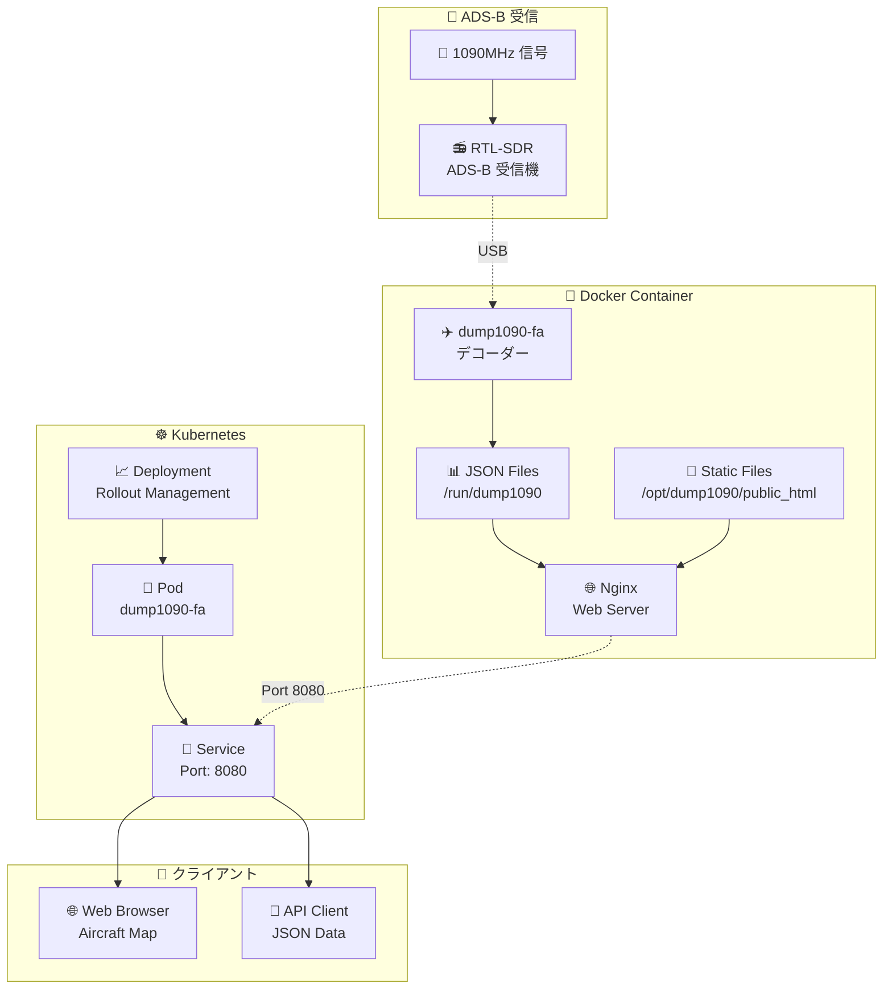
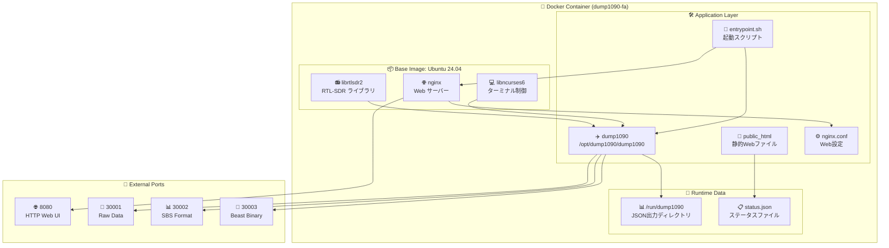
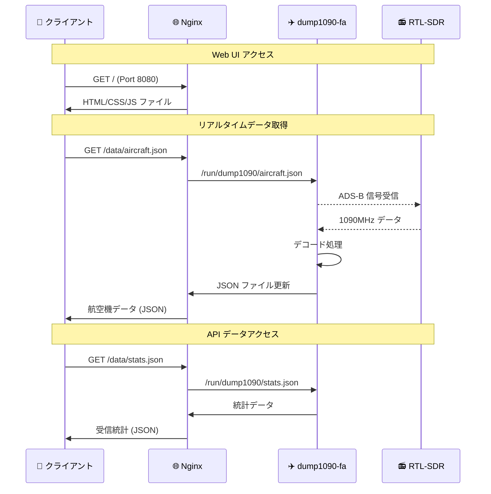
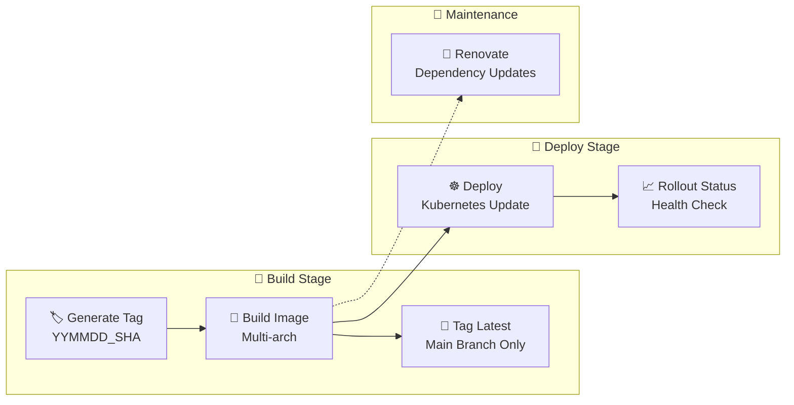

# ✈️ dump1090-fa Docker

Kubernetes 対応の dump1090-fa コンテナ化プロジェクト

[](https://gitlab.green-rabbit.net/kimata/dump1090-fa/-/pipelines)

## 📑 目次

- [📋 概要](#-概要)
  - [主な特徴](#主な特徴)
- [🏗️ システム構成](#️-システム構成)
  - [アーキテクチャ概要](#アーキテクチャ概要)
  - [コンテナ構成](#コンテナ構成)
  - [ネットワーク構成](#ネットワーク構成)
- [🚀 セットアップ](#-セットアップ)
  - [必要な環境](#必要な環境)
  - [1. リポジトリのクローン](#1-リポジトリのクローン)
  - [2. Docker イメージのビルド](#2-docker-イメージのビルド)
- [💻 実行方法](#-実行方法)
  - [Docker で実行](#docker-で実行)
  - [Kubernetes で実行](#kubernetes-で実行)
- [🔧 設定](#-設定)
  - [Nginx 設定](#nginx-設定)
  - [dump1090-fa 設定](#dump1090-fa-設定)
- [📊 CI/CD](#-cicd)
  - [GitLab CI パイプライン](#gitlab-ci-パイプライン)
  - [自動デプロイ](#自動デプロイ)
- [🌐 ポート構成](#-ポート構成)
- [📝 ライセンス](#-ライセンス)

## 📋 概要

[dump1090-fa](https://github.com/flightaware/dump1090) を Docker コンテナ化し、Kubernetes 環境での運用を可能にするプロジェクトです。ADS-B 信号を受信して航空機の位置情報をデコードし、Web インターフェースで表示します。

### 主な特徴

- 📦 **コンテナ化** - Docker による環境の標準化
- ☸️ **Kubernetes 対応** - クラスター環境での運用
- 🌐 **Web インターフェース** - Nginx によるHTTP配信
- 🛡️ **マルチアーキテクチャ** - AMD64/ARM64 対応
- 🔄 **自動デプロイ** - GitLab CI/CD による継続的配信
- 📊 **JSON API** - リアルタイムデータの JSON 形式配信

## 🏗️ システム構成

### アーキテクチャ概要



### コンテナ構成



### ネットワーク構成



## 🚀 セットアップ

### 必要な環境

- 🐳 Docker 20.10+
- ☸️ Kubernetes 1.20+ (クラスター運用時)
- 📻 RTL-SDR 対応USB受信機
- 🖥️ Linux 環境 (推奨: Ubuntu/Debian)

### 1. リポジトリのクローン

```bash
git clone https://github.com/kimata/dump1090-fa.git
cd dump1090-fa
```

### 2. Docker イメージのビルド

```bash
# マルチアーキテクチャビルド
docker buildx build --platform linux/amd64,linux/arm64/v8 -t dump1090-fa .

# 単一アーキテクチャビルド
docker build -t dump1090-fa .
```

## 💻 実行方法

### Docker で実行

```bash
# 基本実行 (RTL-SDR デバイス接続が必要)
docker run --rm -it \
  --device=/dev/bus/usb \
  -p 8080:8080 \
  -p 30001:30001 \
  -p 30002:30002 \
  -p 30003:30003 \
  dump1090-fa

# Web UI アクセス
open http://localhost:8080
```

### Kubernetes で実行

```bash
# Kubernetes デプロイメント
kubectl apply -f - <<EOF
apiVersion: apps/v1
kind: Deployment
metadata:
  name: dump1090-fa
  namespace: sensor
spec:
  replicas: 1
  selector:
    matchLabels:
      app: dump1090-fa
  template:
    metadata:
      labels:
        app: dump1090-fa
    spec:
      containers:
      - name: dump1090-fa
        image: registry.example.com/dump1090-fa:latest
        ports:
        - containerPort: 8080
        - containerPort: 30001
        - containerPort: 30002
        - containerPort: 30003
---
apiVersion: v1
kind: Service
metadata:
  name: dump1090-fa-service
  namespace: sensor
spec:
  selector:
    app: dump1090-fa
  ports:
  - name: http
    port: 8080
    targetPort: 8080
  - name: raw
    port: 30001
    targetPort: 30001
  - name: sbs
    port: 30002
    targetPort: 30002
  - name: beast
    port: 30003
    targetPort: 30003
EOF
```

## 🔧 設定

### Nginx 設定

`nginx.conf` でWebサーバーの動作を制御：

- 🌐 **HTTP サーバー**: ポート 8080 でリスニング
- 📊 **データエンドポイント**: `/data` で JSON ファイルを配信
- 📄 **静的ファイル**: `/` で Web UI を配信

### dump1090-fa 設定

`entrypoint.sh` で dump1090-fa の動作を制御：

- 📊 **統計出力**: 60秒間隔で統計情報を更新
- 🌐 **ネットワーク機能**: 有効化
- 📁 **JSON 出力**: `/run/dump1090` ディレクトリに出力

## 📊 CI/CD

### GitLab CI パイプライン



### 自動デプロイ

- 🎯 **トリガー**: main ブランチへのプッシュ
- 🏷️ **タグ生成**: `YYMMDD_CommitSHA` 形式
- 🏗️ **マルチアーキテクチャビルド**: AMD64/ARM64
- ☸️ **Kubernetes デプロイ**: sensor namespace
- ✅ **ヘルスチェック**: rollout status 確認

## 🌐 ポート構成

| ポート | プロトコル | 用途 | 説明 |
|--------|------------|------|------|
| 🌐 **8080** | HTTP | Web UI | ブラウザでのマップ表示 |
| 📡 **30001** | TCP | Raw Data | 生の ADS-B データ出力 |
| 📊 **30002** | TCP | SBS Format | SBS1 BaseStation 形式 |
| 🔗 **30003** | TCP | Beast Binary | Mode-S Beast バイナリ形式 |

## 📝 ライセンス

このプロジェクトのコンテナ化部分は Apache License Version 2.0 のもとで公開されています。

dump1090-fa 本体は [FlightAware](https://github.com/flightaware/dump1090) の GPL ライセンスに従います。

---

<div align="center">

**⭐ このプロジェクトが役に立った場合は、Star をお願いします！**

[🐛 Issue 報告](https://github.com/kimata/dump1090-fa/issues) | [💡 Feature Request](https://github.com/kimata/dump1090-fa/issues/new) | [📖 dump1090-fa 公式](https://github.com/flightaware/dump1090)

</div>